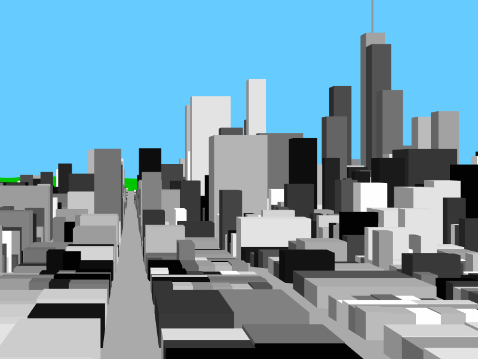

# City Tour

Visit a procedurally generated city, different each time. Sit back and enjoy the ride!

<https://www.joelstrait.com/citytour/>

Made using [three.js](http://threejs.org) and WebGL.

## How It Works

First, blueprints of the world are generated:

* A terrain map
* A road network that follows the terrain
* Empty building lots along roads
* Buildings in the lots

The results are different each time due to random variation, but follow configurable rules.

Next, this abstract definition is turned into a 3D model that can be rendered with WebGL, with the help of [three.js](http://threejs.org).

Finally, a rendering loop begins which moves a three.js camera around the scene.

## Local Development

* `city_tour.html` requires `city_tour.js`, which is a minified and concatenated build of the source files. It's not included in this repo. You'll need to generate it locally by running `yarn install` (if this is your first build) and then `yarn run build`. Open `city_tour.html` in your browser and you should be good to go!
* To automatically re-build when a source file changes:
  * Install the `rb-fsevent` Ruby gem: `gem install rb-fsevent`
  * Run `ruby build.rb --watch`. Each time a file under `/src` changes, `yarn run build` will automatically be run.
* To run the tests, open `spec/SpecRunner.html` in your browser
